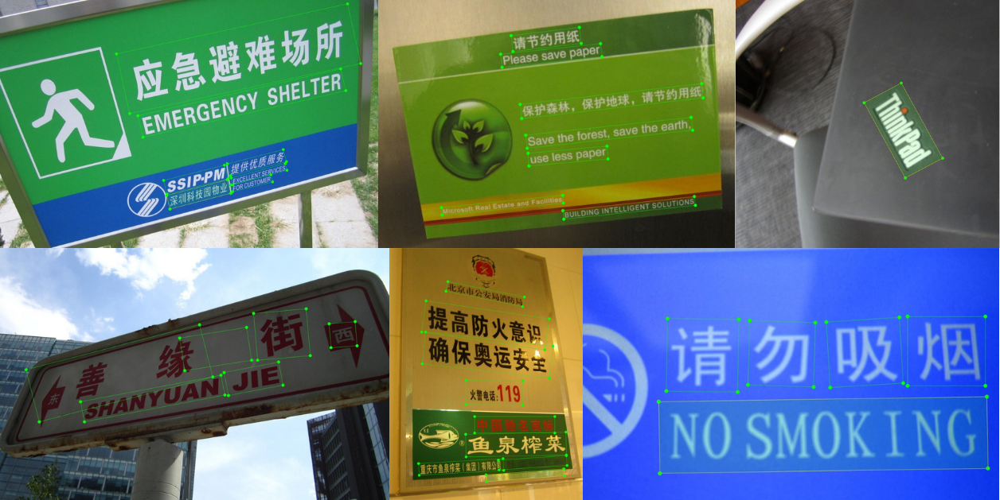

Italiano | [English](https://README.md)

<div align="center">
  
</div>

# Guida a PPOCRLabel e PaddleOCR per addestrare modelli OCR personalizzati

Questa guida spiega come costruire un flusso completo per addestrare un modello OCR personalizzato con PPOCRLabel e PaddleOCR, partendo dall’annotazione delle immagini fino all’esportazione di un modello di inferenza pronto per il deployment.

È fatta soprattutto per ambienti Linux, ma la stessa struttura si applica anche a Windows con piccoli adattamenti nei percorsi.

## Ambito

PPOCRLabel è uno strumento di annotazione semi-automatica per OCR. Supporta l’annotazione delle caselle di testo, il riconoscimento automatico, l’annotazione di tabelle, l’annotazione di testo irregolare e l’esportazione diretta di file che possono essere usati per l’addestramento dei modelli di detection e recognition di PP-OCR.

Il flusso di personalizzazione documentato da PaddleOCR è organizzato in tre fasi: addestramento di un modello di text detection, addestramento di un modello di text recognition e combinazione dei componenti addestrati in una pipeline OCR per l’inferenza.

Questo documento si concentra principalmente sul workflow di addestramento della text recognition, perché i comandi raccolti ruotano attorno alla configurazione e all’export del modello `rec`, mostrando comunque dove si inserisce l’addestramento della detection nell’architettura complessiva.

## Configurazione dell'ambiente

Puoi usare Conda per la gestione dell’ambiente su tutte le piattaforme, ma è particolarmente utile su Windows. Su Linux, è anche comune usare un flusso basato su `python`/`pip` semplice oppure Docker invece di Conda.

#### Linux (senza Conda, opzionale)

Su Linux, puoi saltare del tutto Conda e lavorare con Python di sistema oppure con un virtualenv:

```bash
cd /ocr
python3 -m venv venv
source venv/bin/activate
```

#### Windows (consigliato con Conda)

```bash
cd \ocr
conda create -n paddle_env python=3.8
conda activate paddle_env
```
---
Installa il runtime PaddlePaddle che corrisponde all’hardware di destinazione. Gli ambienti solo CPU devono usare il pacchetto CPU, mentre i sistemi NVIDIA con uno stack CUDA supportato possono usare il pacchetto GPU. (Vedi [qui](https://www.paddlepaddle.org.cn/en/install/quick))

```bash
# CPU
python -m pip install paddlepaddle==3.2.0 -i https://www.paddlepaddle.org.cn/packages/stable/cpu/

# GPU
python -m pip install paddlepaddle-gpu==3.2.0 -i https://www.paddlepaddle.org.cn/packages/stable/cu126/
```

Clona PaddleOCR e installa le sue dipendenze.

```bash
git clone https://github.com/PaddlePaddle/PaddleOCR.git
cd PaddleOCR
pip install -r requirements.txt
```

Clona PPOCRLabel e installalo in modalità editable per rendere più semplici le personalizzazioni locali. Il README del progetto documenta anche sia la modalità di avvio tramite wheel sia quella tramite script Python.

```bash
cd /ocr
git clone https://github.com/PFCCLab/PPOCRLabel.git
cd PPOCRLabel
pip install -e .
pip install --upgrade "paddlex[ocr]"
pip install premailer
pip install pywin32
```

## Avvio di PPOCRLabel

PPOCRLabel parte in cinese di default, e il repository indica esplicitamente che la modalità UI in inglese richiede il flag `--lang en`.

Su Windows, attiva l’ambiente virtuale Conda e spostati nella directory di PPOCRLabel dal terminale di Conda. 
```bash
conda activate paddle_env
cd ...\PPOCRLabel
python PPOCRLabel.py --lang en
```

Se lo strumento è installato come pacchetto, può anche essere avviato direttamente come `PPOCRLabel`, ma eseguire `PPOCRLabel.py` è l’opzione migliore quando servono modifiche locali.

## Workflow di annotazione

Dopo l’avvio, apri la directory delle immagini dal menu `File`. PPOCRLabel tratta la cartella selezionata come progetto e importa le immagini direttamente nella vista dell’applicazione.

Un workflow pratico per l’annotazione del riconoscimento è:

1. Apri la directory delle immagini sorgente.
2. Esegui **Auto recognition** per pre-annotare le immagini che sono ancora marcate come non verificate.
3. Usa `W` per le box rettangolari oppure `Q` per le box a quattro punti quando servono regolazioni manuali.
4. Modifica manualmente il testo di recognition nel pannello dei risultati quando le predizioni sono sbagliate.
5. Premi **Check** per confermare l’immagine e passare alla successiva.
6. Esporta i risultati di recognition per generare le immagini di testo ritagliate e il file di annotazione `rec_gt.txt`.

Il repository di PPOCRLabel documenta due output chiave generati nella cartella del dataset: `Label.txt` per l’addestramento della detection e `rec_gt.txt` più `crop_img/` per l’addestramento della recognition.

## Output del dataset da PPOCRLabel

Il repository descrive così lo scopo dei file esportati.

| File           | Scopo                                                                 |
|----------------|-----------------------------------------------------------------------|
| `Label.txt`    | File delle label per l’addestramento del modello di detection PP-OCR.  |
| `rec_gt.txt`   | File delle label per il riconoscimento generato tramite **File → Export Recognition Results**. |
| `crop_img/`    | Dataset di immagini di testo ritagliate generato insieme a `rec_gt.txt` per l’addestramento del recognition. |
| `fileState.txt`| Tiene traccia di quali immagini sono state confermate manualmente.     |
| `Cache.cach`   | Cache del riconoscimento usata dall’applicazione.                     |

Per un recognizer personalizzato, `rec_gt.txt` e `crop_img/` sono gli output principali usati per preparare gli split finali di train e validation.

## Suddivisione di train, validation e test

Il repository di PPOCRLabel include uno script di split del dataset chiamato `gen_ocr_train_val_test.py` e documenta i parametri `trainValTestRatio` e `datasetRootPath`.

```bash
python gen_ocr_train_val_test.py --trainValTestRatio 8:2:0 --datasetRootPath /progetto_ocr/PaddleOCR/train_data/images
```

La documentazione upstream mostra un pattern d’uso tipico come `6:2:2`, e lo stesso meccanismo si può adattare a `8:2:0` quando non serve uno split di test dedicato nella fase iniziale di sperimentazione.

In pratica, assicurati che la root del dataset contenga gli artifact di recognition esportati, soprattutto `rec_gt.txt` e `crop_img/`, perché sono gli output standard di PPOCRLabel pensati per l’addestramento del modello di recognition.

## Struttura del progetto consigliata

Sotto è mostrata una struttura pulita per un progetto di training del recognition.

```text
ocr/
├── PaddleOCR/
│   ├── configs/
│   ├── pretrain_models/
│   ├── tools/
│   ├── train_data/
│   │   ├── crop_img/
│   │   ├── rec_gt.txt
│   │   ├── train.txt
│   │   ├── val.txt
│   │   └── my_rec.yml
│   └── output/
└── PPOCRLabel/
```

Questo mantiene configurazioni di PaddleOCR, pesi preaddestrati, manifest del dataset e output di training in una struttura locale al repository, facile da mantenere.

## Scelta tra training di recognition e detection

PaddleOCR documenta il training OCR custom come una pipeline a due modelli: la text detection trova le regioni di testo, e la text recognition decodifica il contenuto testuale ritagliato.

Se le immagini sono già ritagliate per parola, riga, targa o token, spesso è sufficiente addestrare solo il recognition. Se l’applicazione finale deve localizzare il testo dentro documenti completi o immagini naturali, serve anche un modello di detection.

I comandi raccolti per questo progetto puntano a `configs/rec/...` e `tools/export_model.py` per un modello di recognition, quindi il resto di questa guida si concentra sul workflow del recognizer.

## Preparazione di una configurazione YAML per il recognition

Un approccio comune è partire da un file YAML ufficiale di recognition e personalizzarlo per il dataset del progetto.

File base di esempio:

```bash
cd /ocr/PaddleOCR
cp configs/rec/PP-OCRv5/PP-OCRv5_server_rec.yml train_data/my_rec.yml
```

### Sezioni YAML più importanti

Le sezioni più importanti da modificare in una configurazione custom di recognition sono elencate qui sotto.

| Sezione         | Cosa impostare                                                          | Perché è importante                                              |
|-----------------|-------------------------------------------------------------------------|------------------------------------------------------------------|
| `Global`        | `epoch_num`, `save_model_dir`, `pretrained_model`, `use_gpu`           | Controlla runtime, posizione dei checkpoint, inizializzazione e uso hardware. |
| `Train.dataset` | `data_dir`, `label_file_list`                                           | Punta il training alle immagini ritagliate e al manifest di train. |
| `Eval.dataset`  | `data_dir`, `label_file_list`                                           | Punta la valutazione al manifest di validation.                |
| `PostProcess`   | Tipo di decoder e path del dizionario, se necessario                   | Deve combaciare con spazio delle label e head del modello.      |
| `Architecture`  | Architettura di recognition e backbone                                 | Definisce il compromesso tra capacità e velocità del recognizer. |
| `Optimizer`     | Learning rate e regolarizzazione                                        | Influisce molto sul comportamento della convergenza.            |

Sotto c’è un template pratico di esempio per un modello custom di recognition.

```yaml
Global:
  use_gpu: true
  epoch_num: 200
  log_smooth_window: 20
  print_batch_step: 10
  save_model_dir: ./output/rec_custom_v5
  save_epoch_step: 5
  eval_batch_step: 
  pretrained_model: ./pretrain_models/ch_PP-OCRv4_rec_server_train/best_accuracy
  cal_metric_during_train: true

Architecture:
  model_type: rec
  algorithm: CRNN
  Transform:
  Backbone:
    name: MobileNetV3
    scale: 0.5
    model_name: large
  Neck:
    name: SequenceEncoder
    encoder_type: rnn
    hidden_size: 48
  Head:
    name: CTCHead
    fc_decay: 0.00001

Loss:
  name: CTCLoss

Optimizer:
  name: Adam
  beta1: 0.9
  beta2: 0.999
  lr:
    name: Cosine
    learning_rate: 0.001
  regularizer:
    name: L2
    factor: 0.00004

PostProcess:
  name: CTCLabelDecode
  character_dict_path: ./ppocr/utils/en_dict.txt
  use_space_char: true

Metric:
  name: RecMetric
  main_indicator: acc

Train:
  dataset:
    name: SimpleDataSet
    data_dir: ./train_data/crop_img
    label_file_list:
      - ./train_data/train.txt
    transforms:
      - DecodeImage:
          img_mode: BGR
          channel_first: false
      - CTCLabelEncode:
      - RecResizeImg:
          image_shape:[1]
      - KeepKeys:
          keep_keys: [image, label, length]
  loader:
    shuffle: true
    batch_size_per_card: 64
    drop_last: false
    num_workers: 4

Eval:
  dataset:
    name: SimpleDataSet
    data_dir: ./train_data/crop_img
    label_file_list:
      - ./train_data/val.txt
    transforms:
      - DecodeImage:
          img_mode: BGR
          channel_first: false
      - CTCLabelEncode:
      - RecResizeImg:
          image_shape:[1]
      - KeepKeys:
          keep_keys: [image, label, length]
  loader:
    shuffle: false
    drop_last: false
    num_workers: 4
```

### Note chiave sulla personalizzazione YAML

Usa `data_dir: ./train_data/crop_img` quando fai training dagli export di recognition di PPOCRLabel, perché `crop_img/` è la directory generata dallo strumento per i campioni di recognition.

Usa `label_file_list` per puntare a manifest testuali come `train.txt` e `val.txt` creati nel passaggio di split. Questi file manifest devono mappare ogni immagine ritagliata alla relativa trascrizione.

Imposta `character_dict_path` su un dizionario che corrisponda al set di caratteri target. Per progetti solo inglese, di solito va bene un dizionario inglese, mentre set alfanumerici misti o simboli specifici di dominio possono richiedere un file dizionario custom.

Mantieni allineati `PostProcess`, `Loss` e la head del modello. Per esempio, `CTCLabelDecode`, `CTCLoss` e `CTCHead` sono pensati per lavorare insieme in un recognizer basato su CTC.

### Quando usare un dizionario caratteri custom

Un dizionario custom è consigliato quando il dominio target usa solo un set ristretto di simboli, come numeri, codici prodotto in maiuscolo, serial number, targhe o label industriali vincolate.

Ridurre lo spazio delle label può migliorare la convergenza e ridurre la confusione tra caratteri visivamente simili, purché il dizionario copra completamente i dati reali di produzione.

Un semplice file di dizionario custom può contenere un simbolo per riga, per esempio:

Quando viene introdotto un dizionario custom, lo YAML deve referenziarlo tramite `character_dict_path`, e le label di training in `train.txt` e `val.txt` devono contenere solo simboli inclusi nel dizionario.

## Comandi di training

I comandi raccolti includono il training diretto con la configurazione ufficiale di recognition PP-OCRv5.

```bash
python ./tools/train.py -c ./configs/rec/PP-OCRv5/PP-OCRv5_server_rec.yml
```

Per un progetto riproducibile, è meglio addestrare invece contro lo YAML personalizzato.

```bash
cd /ocr/PaddleOCR
python tools/train.py -c train_data/my_rec.yml
```

L’altro set di comandi inizializza anche il training da un checkpoint pretrained di recognition usando l’override `-o Global.pretrained_model=...`.

```bash
python tools/train.py -c train_data/my_rec.yml -o Global.pretrained_model=pretrain_models/ch_PP-OCRv4_rec_server_train/best_accuracy
```

Questo è il pattern consigliato per il fine-tuning, perché riutilizza un recognizer pretrained e di solito converge più velocemente rispetto al training da zero.

## Monitoraggio degli output

Durante il training, PaddleOCR scrive i checkpoint nella directory configurata in `Global.save_model_dir`. I checkpoint pratici da tenere d’occhio sono in genere `latest` e il checkpoint con le prestazioni migliori, spesso chiamato `best_accuracy`.

Una struttura tipica degli output è questa:

```text
output/
└── rec_custom_v5/
    ├── best_accuracy/
    ├── latest/
    ├── train.log
    └── vdl/
```

Se l’accuratezza di validation si stabilizza presto, le prime variabili da rivedere sono le impostazioni di normalizzazione delle immagini, la correttezza del dizionario, la qualità delle label, la batch size e la schedule del learning rate.

## Esportazione del modello di inferenza

Dopo il training, usa `tools/export_model.py` per convertire un checkpoint di training in una directory di modello pronta per l’inferenza.

I comandi raccolti seguono già il pattern corretto: passa lo YAML, punta `Global.pretrained_model` al checkpoint salvato e imposta `Global.save_inference_dir` sulla directory di export.

Esempio basato sullo YAML specifico del progetto:

```bash
python tools/export_model.py -c train_data/my_rec.yml -o Global.pretrained_model=./output/rec_custom_v5/best_accuracy Global.save_inference_dir=./output/rec_custom_v5_infer
```

Esempio basato sulla configurazione di recognition server PP-OCRv5:

```bash
python3 tools/export_model.py -c configs\\rec\\PP-OCRv5\\PP-OCRv5_server_rec.yml -o Global.pretrained_model=./output/PP-OCRv5_server_rec/latest Global.save_inference_dir=./output/PP-OCRv5_server_rec_infer
```

## Formato del manifest di recognition

Per l’addestramento del recognition, file come `train.txt` e `val.txt` sono in genere semplici file di testo che mappano ogni immagine ritagliata alla sua label.

Un formato comune è:

```text
crop_img/word_001_crop_0.jpg\tInvoice
crop_img/word_002_crop_0.jpg\tA1024
crop_img/word_003_crop_0.jpg\t59.90
```

Il tipo di path può essere relativo o assoluto, purché sia coerente con `data_dir` nello YAML e con le aspettative del data loader.

## Estensione per il training della detection

Se l’applicazione finale deve rilevare il testo in immagini complete, lo stesso progetto può essere esteso addestrando un modello di detection usando il file `Label.txt` esportato da PPOCRLabel, perché il repository indica che `Label.txt` è pensato direttamente per l’addestramento del modello di detection PP-OCR.

La guida di personalizzazione di PaddleOCR inquadra questo come il primo passo di un sistema OCR completo, seguito dal training del recognition e poi dalla combinazione delle predizioni dei due modelli.

In altre parole, PPOCRLabel può alimentare entrambe le branche della pipeline OCR: detection tramite `Label.txt` e recognition tramite `rec_gt.txt` più `crop_img/`.
